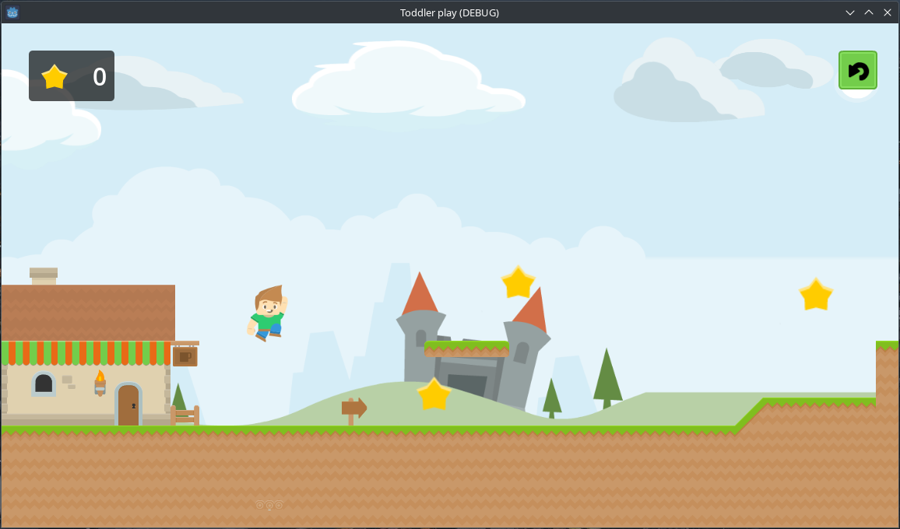

# Toddler play

Simple and beautiful 2D platformer for children made in Godot v4.2.2.

I make it in my spare time for myself (to learn game engine) and for my kid (to learn keyboard and coordination and just to have some fun).



## Pickups

**Yellow star** adds +1 to score count.

Stars are just visible navigation points that help a child to navigate in game level by pressing buttons to move in the desired direction (separately or simultaneously), overcome obstacles and reach the end.

Star count is just a number in the upper left corner that does nothing and does not affect anything.

**Green flag** finishes current level and loads next one.
When picked up in last level first one will be loaded.

## Controls

| Keys                    | Action                         |
|-------------------------|--------------------------------|
| `A`, `ArrowLeft`        | Move left                      |
| `D`, `ArrowRight`       | Move right                     |
| `W`, `ArrowUp`, `Space` | Jump                           |
| `Enter`                 | Start game (in main menu)      |
| `Enter`, `R`            | Restart level (in game)        |
| `1-9`                   | Start selected level (in game) |

Also in some levels there are some spring jumpers to jump higher.

## Installation

Just download a binary file for your OS from [Releases](https://github.com/anthonyaxenov/toddler-play/releases) page somewhere on your drive and run.

## Compiling

1. Install Godot v4.*
2. Clone this project into directory of your choice:
```
git clone https://github.com/anthonyaxenov/toddler-play.git
```
3. Open cloned project in Godot
4. Go to Project - Export... in main menu
5. Select a template according to destination OS and press Export
6. Run freshly squeezed executable binary from `./build` folder

## License

You can use this project under the terms of the [MIT License](LICENSE) respecting licenses of 3rd-party resources used in this project.
Information about ones you can find in [`./assets`](assets) folder.
